*****************************************
DSS Service Developer's Quick Start Guide
*****************************************

This quick start guide walks you through creating a new service from scratch. We will first create a local DSS installation using Docker, and then create our own segmentation service.

Prerequisites
=============
* `ITK-SNAP <itksnap.org>`_ 3.8 or later;
* `Docker <www.docker.com>`_;
* Familiarity with Bash scripting;
* A `GitHub <www.github.com>`_ account and basic Git familiarity.

DSS Architecture Overview
=========================
DSS architecture consists of three layers:

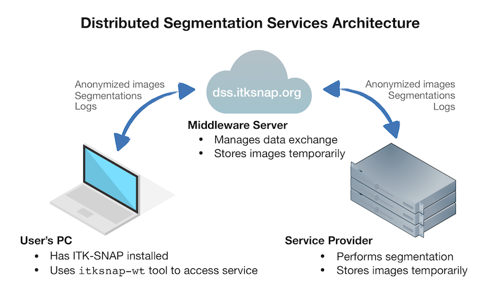

**client**
  A GUI or command-line tool that communicates with DSS over the web. Existing DSS clients are the ITK-SNAP GUI (after version 3.8) and the command-line tool **itksnap-wt** which is bundled with ITK-SNAP.
  
**middleware**
  The middleware layer is a web application written in Python that orchestrates communication between multiple service providers and multiple clients. The main *production* DSS middleware is running at https://dss.itksnap.org. However, users can also run their own local copies of the middleware layer, e.g., for testing. 
  
**service**
  Algorithm developers provide their tools as DSS services. For example, an algorithm for segmenting hippocampal subfields, called ASHS, is currently provided as a service at https://dss.itksnap.org. This means that any ITK-SNAP user can take advantage of this service to perform hippocampal subfield segmentation on their MRI data. Services communicate with the DSS middleware layer using **itksnap-wt**.
  
This tutorial describes how to create your own service and hook it up to DSS.

Running DSS locally
===================
The first step to creating your own DSS service is to launch a local DSS middleware layer. This will make it possible to test your service. 

Set up DSS middleware
---------------------

Clone the DSS middlware Git repository::

    git clone https://github.com/pyushkevich/alfabis_server
    cd alfabis_server
    
The following command will create three Docker containers, one containing the SQL database for the middleware layer, another running the middleware web application, and the third running an example DSS service (a simple algorithm that crops out the neck in 3D MRI scans).::

    docker-compose up

After running the command, you will see a lot of output in the terminal, colored by the container producing this output. To test if the container is working, connect to it using the web browser, using the URL `http://localhost:8080`_

.. note:: Port 8080 must be available on your host machine. If it is not, edit the file *docker-compose.yml* and change the first number under **ports** to the number of the port that is available to you. 

When you visit `<http://localhost:8080>`_ you should see a functioning web page like the one captured below. The middleware server is set up in "ridiculously unsecure" test mode, where everyone accessing the server has administrator access. This is intended for testing the system on your own machine. You should **never use this server in a production setting**.

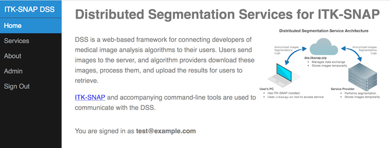

Connect to DSS with ITK-SNAP GUI
--------------------------------

Next, connect to the server using ITK-SNAP. Open ITK-SNAP and in the main menu, select *Tools->Distributed Segmentation Service*. In the *Connect* tab, press the button **Manage...** and paste the URL of your middleware server (`<http://localhost:8080>`_). 

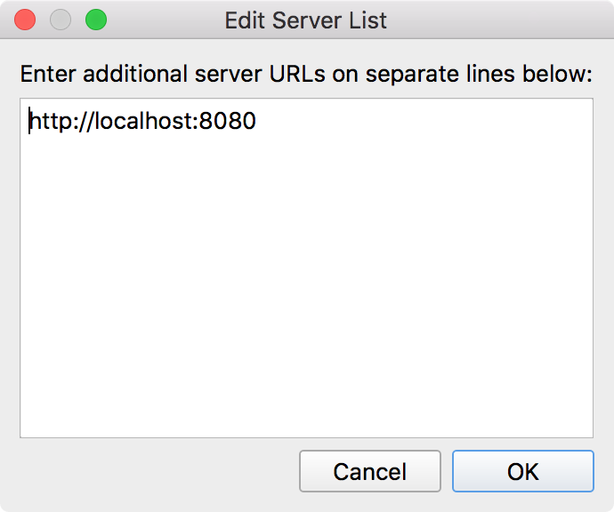

Now press the **Get Token** button, which will open your web browser on a page showing a 40-digit *authentication token*. Normally, you would need to login using `OAuth2 <https://oauth.net/2/>`_ and accept terms of service, but in the ridiculously unsecure test mode you are automatically logged in as user :code:`test@example.com` and so the token is shown to you right away.
  
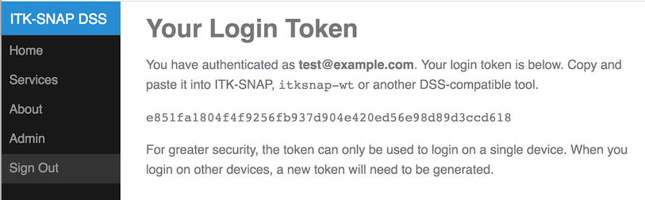

Copy and paste the token into the corresponding text box in ITK-SNAP. The server status should indicate successful connection, as shown below:
  
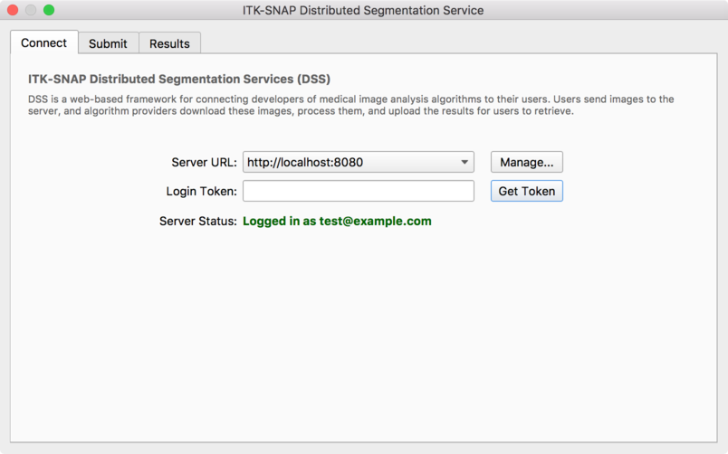

Switch over to the *Submit* page. You should see a single service under the list of services, called "MRI NeckCut 1.0.0". This service is running in one of your Docker containers. Given a T1-weighted MRI scan of an adult's head, this service will find the top of the head and crop out an 18cm region of interest from the top of the head down, i.e., cropping out excessive neck tissue. This is useful as a preprocessing step for registering MRI scans between individuals.

Try out the service on any T1-weighted brain dataset (but not one that has already been skull-stripped). For example, you can download sample datasets from `ADNI <http://adni.loni.usc.edu/data-samples/access-data/>`_. The result of running the pipeline should look something like what you see below.
  
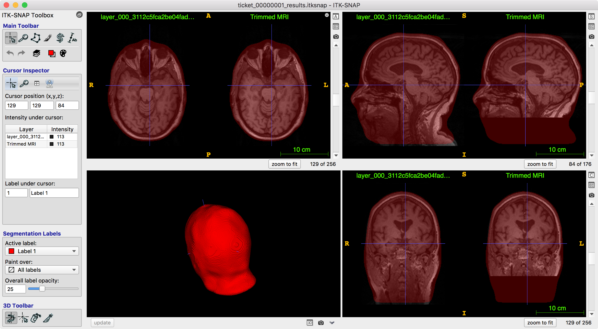

    Result of running the example service on a T1 head scan. The neck is cropped away and a segmentation of the head/neck is created.

Writing Your Own Service
========================

In this section of the tutorial, you will create your own service. This consists of two parts: creating a public Git repository that describes the service and writing the back-end script that executes the service. 

.. note:: If instead of a step-by-step tutorial you would like to see the complete code for a simple service, see :code:`testing/example_service` in this repository.

Our Example Service
-------------------
We will implement an example service that performs deformable registration between two images and maps the labels from one image onto the other. This may be useful for tracking the change in the size of lesions over time, etc. In their ITK-SNAP workspace, the users will need to tag the source image (e.g., the first time point) and the target image (the second time point). Labels will be transformed from the source image to the target image.

Creating a Service Description
------------------------------
In this tutorial, the directory structure for your service looks like this::

    my_service/
      desc/                 # The Git repository describing the service
      daemon/               # The directory where the scripts running the service are located
        work/               # The directory where processing data for tickets is stored

Create this structure, enter the ``desc`` directory, and use your favorite text editor to edit the file ``service.json``::

    cd desc
    nano service.json
  
The file ``service.json`` is used to explain to the users what kind of input the service requires and what type of results it generates.  The contents of ``service.json`` should be as follows. Of course, you can modify any of the descriptive values like "keywords" or "longdesc". 

.. code-block:: json

    {
      "name": "RegistrationExample",
      "version": "0.1.0",
      "keywords": [
        "registration",
        "longitudinal"
      ],
      "shortdesc": "DSS tutorial service (deformable registration)",
      "longdesc": "Given a target image and a source image with labels, perform registration and map labels from the source image to the target image",
      "tags": [
        {
          "name": "Target",
          "type": "MainImage",
          "hint": "The anatomical image onto which you want to warp the segmentation",
          "required": true
        },
        {
          "name": "Source",
          "type": "OverlayImage",
          "hint": "The anatomical image from which you want to warp the segmentation", 
          "required": true
        },
        {
          "name": "SourceSeg",
          "type": "OverlayImage",
          "hint": "The segmentation of the source image",
          "required": true
        }
      ]
    }    

The first part of the ``service.json`` file describes the service at various levels of detail. Additional keywords you can include in a real service are ``citation`` and ``url``. A very important part of the file is the ``tags`` directive. It specifies what kinds of images must be passed in to your pipeline. The ``tags`` directive in this example specifies that the ITK-SNAP workspace passed in to your pipeline must contain an anatomical image (e.g., an MRI) and a segmentation image. Later, in your script, you will use these tag names to extract these images from the workspace.

.. note:: See the reference manual for details on :ref:`refman_service_json`.

Before proceeding, make sure your Json syntax is correct. Use an online validator, such as https://jsonformatter.org or https://jsonlint.com to check for errors. 

.. warning:: If your ``service.json`` file contains invalid syntax, you will receive errors in later stages of the tutorial!

Creating a Git Repository
-------------------------

Next, we will create a public Git repository to hold your service descriptor. First, let's initialize a local Git repository. Making sure you are still in your ``desc`` directory, enter the following commands::

    git init
    git add service.json
    git commit -m "Initial commit of service.json"

Now, go to https://github.com, sign in, and create a new public repository. Let's say the name of your repository is ``my_little_dss_test``. Make sure your repository is **public** and make sure **not** to initialize the repository with a README. 

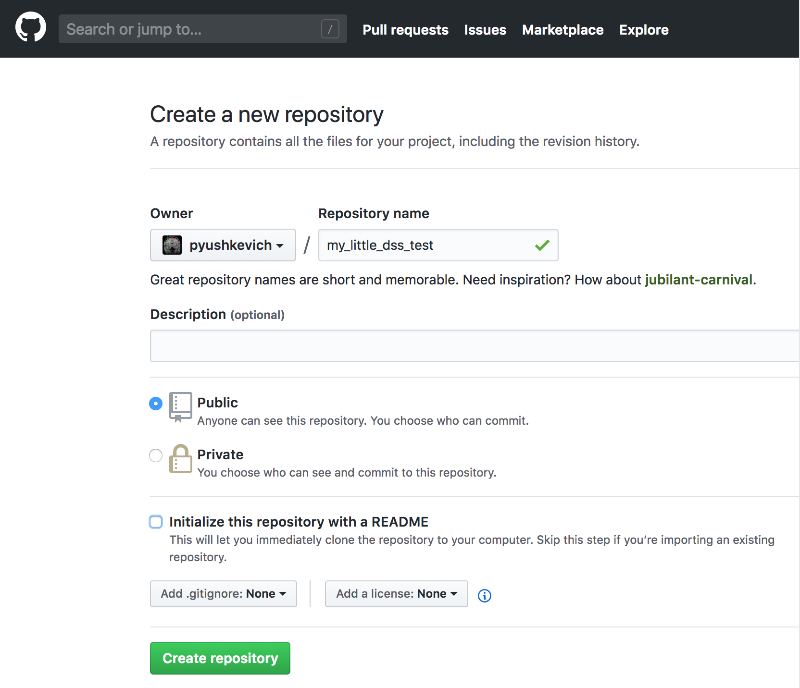

Now, push your local repository to the remote public repository::

    git remote add origin https://github.com/your_github_userid/my_little_dss_test.git
    git push -u origin master

Visit github again to make sure that your ``service.json`` appears there. It should appear at the URL https://github.com/your_github_userid/my_little_dss_test.

Authenticate with DSS
---------------------
Now let's tell your local DSS server about your new service. We will need to authenticate and use DSS administrative commands in ``itksnap-wt`` to do this. Make sure that ``itksnap-wt`` is in your path.

.. note:: ``itksnap-wt`` is the command-line workspace tool included with ITK-SNAP 3.8 and later. On Mac and Windows, from the ITK-SNAP main menu, select *Help->Install Command-Line Tools* to install it and other tools.

First authenticate with your local DSS middleware server::

    >> itksnap-wt -dss-auth http://localhost:8080
    Paste this link into your browser to obtain a token:  http://localhost:8080/token
      Enter the token:

Follow the link ``http://localhost:8080/token``, obtain the token from that link, and paste it into the prompt::

    >> itksnap-wt -dss-auth http://localhost:8080
    Paste this link into your browser to obtain a token:  http://localhost:8080/token
      Enter the token: e851fa1804f4f9256fb937d904e420ed56e98d89d3ccd618
    Success: logged in as test@example.com

The authentication credentials are stored in the ``$HOME/.alfabis`` server, allowing subsequent calls to ``itksnap-wt`` to access the server without having to authenticate.

Register Your Service with DSS
------------------------------
Before registering our service, we need to create a provider entry. A provider represents a group of users who offer a set of services via DSS. For example, a company unit or a research lab. We will create a new provider called ``testlab``::

    itksnap-wt -dssa-providers-add testlab

.. note:: Commands starting with ``-dssa`` are administrative commands. They are available to you on your local DSS middleware server after you login as ``test@example.com``, which has administrator access.

Next, we will provide access to the provider ``testlab`` to the user ``test@example.com``::

    itksnap-wt -dssa-providers-users-add testlab test@example.com

Finally, we will register our service with DSS::

    itksnap-wt -dssa-providers-services-add testlab https://github.com/your_github_userid/my_little_dss_test master

The above command points DSS to the Github repository where you placed ``service.json``. It also tells DSS to use the latest commit in the ``master`` branch of this repository. You can provide any branch, tag, or commit here. Lastly, it tells DSS to associate the service with provider ``testlab``.

Verify that the above commands were successful by listing all services available to you as the provider::

    >> itksnap-wt -P -dssp-services-list
    MRI-NeckCut          1.0.0  e0a316038e9cbe6a000e07c82758532a8863f51f  test
    RegistrationExample  0.1.0  b7392368dc5dcec910bb8b87006ae38fd1f2cb32  testlab

.. note:: Commands starting with ``-dssp`` are service provider commands. They do not require administrator access.

You should now see your service listed:

* When you navigate to `<http://localhost:8080/services>`_ in your browser.
* In the ITK-SNAP GUI, on the "Submit" tab of the DSS window.

Submitting a Ticket for the New Service
---------------------------------------

We are almost ready to code our service. Normally, we would organize our service as a Bash or Python script. However, in this example we will walk through every step of the service interactively, showing you the output of each command used to communicate with the middleware server. The life-cycle of a service is shown in the flowchart below:

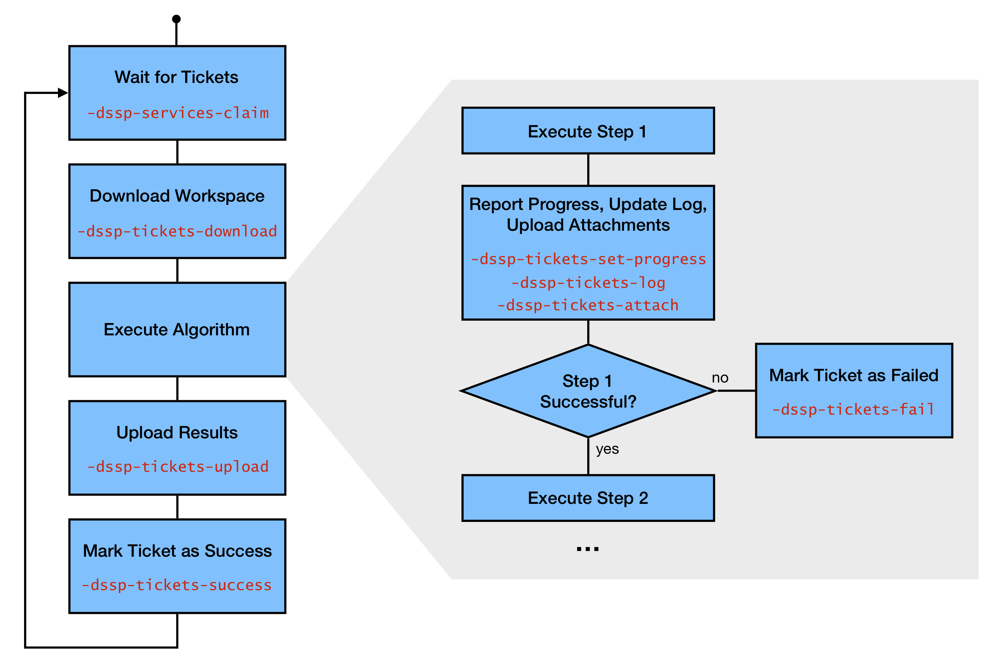

First, go ahead and submit a ticket for your new service. We have provided a sample dataset called ``bav_example.zip`` for this tutorial on the `ITK-SNAP sample data download page <http://www.itksnap.org/pmwiki/pmwiki.php?n=Downloads.Data>`_. Decompress the zip file, and open the workspace ``bav_example.itksnap`` in ITK-SNAP. It should look like the screenshot below. The dataset consists of two time frames in a 3D TEE ultrasound dataset of the bicuspid aortic valve. Frame 14 is the 'target' frame, which we aim to segment, and frame 25 is the 'source' frame, for which we have the manual segmentation. Notice that the manual segmentation is loaded as an "overlay" in ITK-SNAP, rather than a segmentation image. This is because our pipeline is going to support source/target pairs that have different image dimensions, and in ITK-SNAP the segmentation image has to have the same dimensions as the main image.

.. image:: images/dss_itksnap_bav_input.png

Next, go ahead and submit the service. On the "submit" tab of the DSS window, assign the tags you defined in ``service.json`` to the different layers in your workspace, as shown below. Then, press **Submit**. Your ticket should show up on the "Results" tab in "ready" state.

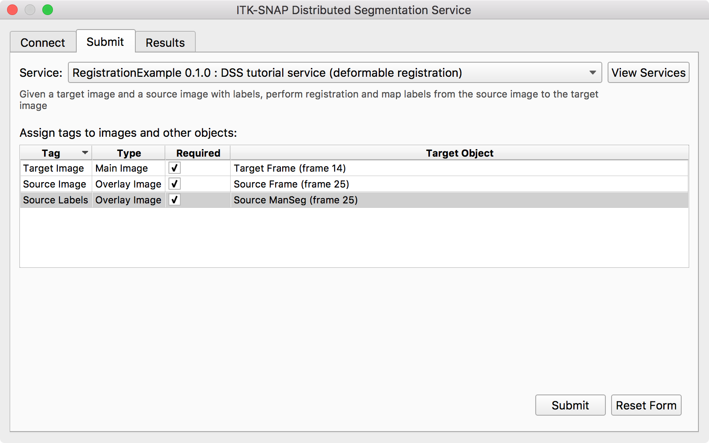
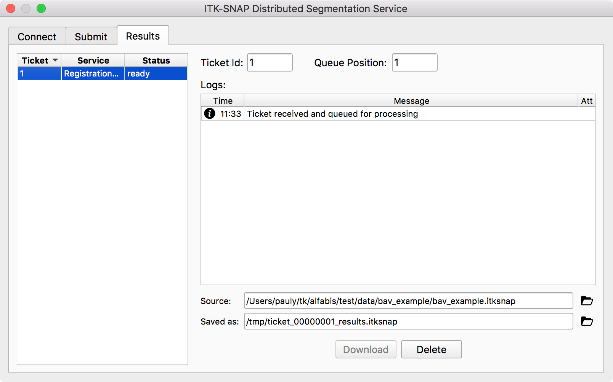

Scripting the Service
---------------------

We are now going to simulate what the service would do. First make sure you are authenticated with the DSS middleware server::

    >> itksnap-wt -dss-auth http://localhost:8080

We will need to know the 40-character Git commit hash of the service we registered with DSS. Obtain it using::

    >> itksnap-wt -P -dssp-services-list
    MRI-NeckCut          1.0.0  e0a316038e9cbe6a000e07c82758532a8863f51f  test
    RegistrationExample  0.1.0  b7392368dc5dcec910bb8b87006ae38fd1f2cb32  testlab

In this case, the hash we will use is ``b7392368dc5dcec910bb8b87006ae38fd1f2cb32``.

Claiming a Ticket
^^^^^^^^^^^^^^^^^

Now we will issue a command to claim the next available ticket for our service. When a ticket is claimed, it is no longer visible to other providers of the service. After claiming a ticket, you are expected to process it right away. To claim the ticket we must provide the service hash code, the name of the provider (``testlab``) and an additional "instance id", which is an arbitrary code used when a provider has multiple "instances" running in parallel. Use the following command to claim the ticket (except your hash code will be different)::

    >> itksnap-wt -dssp-services-claim b7392368dc5dcec910bb8b87006ae38fd1f2cb32 testlab instance_1
    POST http://localhost:8080/api/pro/services/claims VALUES services=8e6886c303260e30e62d67b3347f8ceb234c6d18&provider=testlab&code=instance_1
    1> 1  b7392368dc5dcec910bb8b87006ae38fd1f2cb32  claimed

The "useful" output of this command is on the line that starts with ``1>``. In general, ``itksnap-wt`` prefixes the output of each command with its number, while various informational messages are not labeled. The ``-P`` flag used previously tells ``itksnap-wt`` not to print this prefix. Above, the output of the command consists of the ticket id (``1``), the service hash code, and the status of the ticket (``claimed``). 

.. note:: You can call ``-dssp-services-claim`` with a comma-separated list of service hash codes. In this case, the DSS server will return the highest-priority ticket across all these services. You can use the second field in the output of ``-dssp-services-claim`` to figure out which service that ticket belongs to.

Downloading Ticket Workspace
^^^^^^^^^^^^^^^^^^^^^^^^^^^^

Now that the ticket has been claimed, we should download its data. Let us create a temporary work directory for our ticket::

    >> TICKET_ID=1
    >> WORKDIR=/tmp/dss_work/ticket_${TICKET_ID}
    >> mkdir -p $WORKDIR

And now, download the ticket::

    >> itksnap-wt -dssp-tickets-download $TICKET_ID $WORKDIR
    ...
    1> /tmp/dss_work/ticket_1/layer_000_73f86306f91fdcac7a84159b3a916e21.nii.gz
    1> /tmp/dss_work/ticket_1/layer_001_a8533a499615e024637587466b574689.nii.gz
    1> /tmp/dss_work/ticket_1/layer_002_c3577ae4df83ba30ab4b014ebb577c62.nii.gz
    1> /tmp/dss_work/ticket_1/ticket_00000001.itksnap

The output of the command consists of all of the filenames that have been downloaded from the DSS server. Note that the names of the files have been changed, this is part of the anonymization process.

We can now send a message to the user letting them know that we have downloaded the ticket successfully (this is not necessary, but there is no harm in it either)::

    >> itksnap-wt -dssp-tickets-log $TICKET_ID info "Ticket successfully downloaded"
    POST http://localhost:8080/api/pro/tickets/1/info VALUES message=Ticket successfully downloaded

If you look at the "Results" tab in ITK-SNAP, this message should be visible.

Next, we will extract the layers identified by the different tags (target, source, source segmentation) from the workspace. We can list all of the layers with tags like this::

    >> INPUT_WSP=/tmp/dss_work/ticket_1/ticket_00000001.itksnap
    >> itksnap-wt -i $INPUT_WSP -layers-list
    2> Layer  Role     Nickname                  Filename                                                                  Tags
    2> 000    Main     Target Frame (frame 14)   /tmp/dss_work/ticket_1/layer_000_73f86306f91fdcac7a84159b3a916e21.nii.gz  Target
    2> 001    Overlay  Source Frame (frame 25)   /tmp/dss_work/ticket_1/layer_001_a8533a499615e024637587466b574689.nii.gz  Source
    2> 002    Overlay  Source ManSeg (frame 25)  /tmp/dss_work/ticket_1/layer_002_c3577ae4df83ba30ab4b014ebb577c62.nii.gz  SourceSeg

To extract the filenames of the specific layers::

    >> TARGET_IMG=$(itksnap-wt -P -i $INPUT_WSP -llf Target)
    >> SOURCE_IMG=$(itksnap-wt -P -i $INPUT_WSP -llf Source)
    >> SOURCE_SEG=$(itksnap-wt -P -i $INPUT_WSP -llf SourceSeg)

Perform Image Registration
^^^^^^^^^^^^^^^^^^^^^^^^^^

Next we will use `greedy <https://sites.google.com/view/greedyreg/about>`_, a tool included with ITK-SNAP, to perform registration. We will perform affine registration followed by deformable registration. In some cases, the user may have already performed some registration between the two images using the interactive registration mode in ITK-SNAP. We can check this as follows::

    >> Pauls-MBP-2:tmp pauly$ itksnap-wt -i $INPUT_WSP -layers-pick-by-tag Source -props-get-transform
    INFO: picked layer Layers.Layer[001]
    3> 1 0 -0 -0
    3> 0 1 -0 -0
    3> -0 -0 1 0
    3> 0 0 0 1

The above command first 'picks out' the layer with tag 'Source' and then prints its affine transform relative to the main image. The transform is a 4x4 identity matrix in our example. In the script below, we actually store the transform and use it to initialize affine registration, but here we will not do that since we know the transform is identity. Instead we will go ahead and just perform affine registration::

    >> AFFINE_MAT=$WORKDIR/affine.mat
    >> greedy -d 3 -m NCC 8x8x8 -n 40x40x20 -a -i $TARGET_IMG $SOURCE_IMG -o $AFFINE_MAT -ia-identity
    Executing with the default number of threads: 8
    Noise on image 0 component 0: fixed = 0.224, moving = 0.22
    *************************************************
      N=12   NUMBER OF CORRECTIONS=5       INITIAL VALUES F= -6301.05   GNORM= 442.93
    *************************************************
       I   NFN    FUNC        GNORM       STEPLENGTH
       1    3     -6389.660      87.491       0.001
       2    5     -6418.671      86.297       5.000
    ...
      17   20     -2386.336      14.465       0.316
      18   21     -2386.542       7.294       1.000
    Final RAS Transform:
    1.00004 -0.000740917 -0.000537392 0.0773808
    0.00135426 0.998996 0.00297984 -0.111559
    0.00132127 -0.000743018 1.00355 -0.340851
    0 0 0 1

Affine registration should take about a minute. Please see `greedy documentation <https://sites.google.com/view/greedyreg/about>`_ for an explanation of the parameters.

Now we can inform the user that affine registration completed, that the job is 40% done, and even show them the affine transform matrix::

    >> itksnap-wt -dssp-tickets-attach $TICKET_ID "Affine matrix" $AFFINE_MAT text/plain
    >> itksnap-wt -dssp-tickets-log $TICKET_ID info "Affine registration successful"
    >> itksnap-wt -dssp-tickets-set-progress $TICKET_ID 0 1 0.4

Check your "Results" page in the ITK-SNAP DSS dialog, and you will see this updated information. Click on the paperclip icon, and you will see the matrix.

Now we can perform deformable registration::

    >> WARP=$WORKDIR/warp.nii.gz
    >> greedy -d 3 -m NCC 8x8x8 -n 40x40x20 -i $TARGET_IMG $SOURCE_IMG -it $AFFINE_MAT -o $WARP
    Executing with the default number of threads: 8
    Noise on image 0 component 0: fixed = 0.224, moving = 0.21866
    LEVEL 1 of 3
      Smoothing sigmas: [4.29654, 4.17696, 3.69327], [1.75405, 1.70524, 1.50777]
    Level     0,  Iter     0:    Energy =   0.6955
    Level     0,  Iter     1:    Energy =   0.7112
    ...
    Level     2,  Iter    18:    Energy =   0.3482
    Level     2,  Iter    19:    Energy =   0.3487
    END OF LEVEL     2    DetJac Range:   0.0523  to   6.3114
      Avg. Gradient Time  : 0.6519s  41.43%
      Avg. Gaussian Time  : 0.7485s  47.57%
      Avg. Iteration Time : 1.5734s

Again, update the progress::

    >> itksnap-wt -dssp-tickets-log $TICKET_ID info "Deformable registration successful"
    >> itksnap-wt -dssp-tickets-set-progress $TICKET_ID 0 1 0.8

The next step is to compute a warp that combines the deformable and affine transformations, and to apply the warp to the source image and its segmentation. This is accomplished using the following greedy commands::

    >> RESLICE_SOURCE_IMG=$WORKDIR/reslice_source_img.nii.gz
    >> RESLICE_SOURCE_SEG=$WORKDIR/reslice_source_seg.nii.gz
    >> COMBINED_WARP=$WORKDIR/warp_combined.nii.gz
    >> greedy -d 3 -rf $TARGET_IMG \
        -rm $SOURCE_IMG $RESLICE_SOURCE_IMG \
        -ri LABEL 0.2vox -rm $SOURCE_SEG $RESLICE_SOURCE_SEG \
        -rc $COMBINED_WARP \
        -r $WARP $AFFINE_MAT
    Executing with the default number of threads: 8

Package and Upload Results
^^^^^^^^^^^^^^^^^^^^^^^^^^

Finally, we add these newly generated images to the ITK-SNAP workspace, and save it as a new workspace file::

    >> RESULT_WSP=$WORKDIR/result.itksnap
    >> itksnap-wt -i $INPUT_WSP \
        -layers-add-anat $RESLICE_SOURCE_IMG -props-set-nickname "Resliced Source Image" \
        -layers-add-anat $COMBINED_WARP -props-set-nickname "Deformation Field" -props-set-colormap jet \
        -layers-add-seg $RESLICE_SOURCE_SEG -props-set-nickname "Resliced Segmentation" \
        -layers-list -o $RESULT_WSP
    9> Layer  Role          Nickname                  Filename                                                                  Tags
    9> 000    Main          Target Frame (frame 14)   /tmp/dss_work/ticket_3/layer_000_73f86306f91fdcac7a84159b3a916e21.nii.gz  Target
    9> 001    Overlay       Source Frame (frame 25)   /tmp/dss_work/ticket_3/layer_001_a8533a499615e024637587466b574689.nii.gz  Source
    9> 002    Overlay       Source ManSeg (frame 25)  /tmp/dss_work/ticket_3/layer_002_c3577ae4df83ba30ab4b014ebb577c62.nii.gz  SourceSeg
    9> 003    Overlay       Resliced Source Image     /tmp/dss_work/ticket_3/reslice_source.nii.gz
    9> 004    Overlay       Deformation Field         /tmp/dss_work/ticket_3/warp_combined.nii.gz
    9> 005    Segmentation  Resliced Segmentation     /tmp/dss_work/ticket_3/reslice_source_seg.nii.gz

What's left is to upload this workspace to the DSS middleware server. In the process of uploading, the workspace will be archived into a temporary directory and names of the layers will be replaced by hashes just like in the input workspace::

    >> itksnap-wt -i $RESULT_WSP -dssp-tickets-upload $TICKET_ID
    Exported workspace to /tmp/alfabis_NMYoqn/ticket_00000001_results.itksnap
    Upload /tmp/alfabis_NMYoqn/layer_004_9c0895a61850b6a03458081ab400f029.nii.gz (88.9 Mb in 6.9 s)
    Upload /tmp/alfabis_NMYoqn/layer_000_73f86306f91fdcac7a84159b3a916e21.nii.gz (3.4 Mb in 0.1 s)
    Upload /tmp/alfabis_NMYoqn/layer_001_a8533a499615e024637587466b574689.nii.gz (3.4 Mb in 0.1 s)
    Upload /tmp/alfabis_NMYoqn/layer_002_c3577ae4df83ba30ab4b014ebb577c62.nii.gz (0.0 Mb in 0.0 s)
    Upload /tmp/alfabis_NMYoqn/ticket_00000003_results.itksnap (0.0 Mb in 0.0 s)
    Upload /tmp/alfabis_NMYoqn/layer_003_577f9723a54d1bc8bbfb02369d91ed2f.nii.gz (10.2 Mb in 0.3 s)
    Upload /tmp/alfabis_NMYoqn/layer_005_ebaaaed7ad802e73b94e5d254a7a64c0.nii.gz (0.0 Mb in 0.0 s)

The very final step is to set progress to 100% and mark the ticket as a success::

    >> itksnap-wt -dssp-tickets-set-progress $TICKET_ID 0 1 1 
    >> itksnap-wt -dssp-tickets-success $TICKET_ID

If you return to ITK-SNAP, the ticket should be marked as successful and the download button will be enabled:

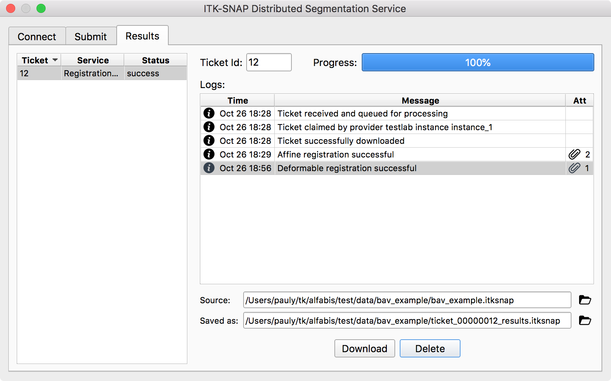

Download the result workspace. If everything worked well, you should see a decent segmentation of your target image, like this:

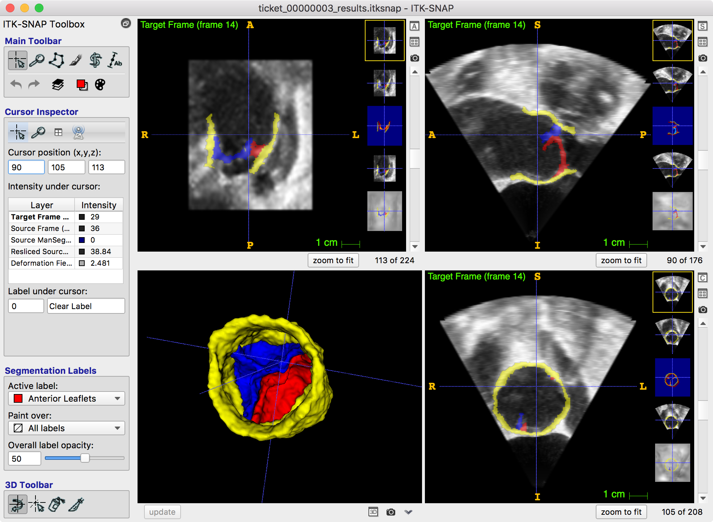

This is pretty much it! We have now walked through all the steps involved in creating a service. A complete script implementing this tutorial service is listed below.

Complete Service Script
^^^^^^^^^^^^^^^^^^^^^^^

Below is the code for a functional script that runs this service. It relies on Unix tools ``grep``, ``awk``, and ``sed`` to capture the output of the various ``itksnap-wt`` commands. It also includes a bit of error checking.

.. literalinclude:: ../testing/tutorial_service/my_service.sh
    :language: bash

