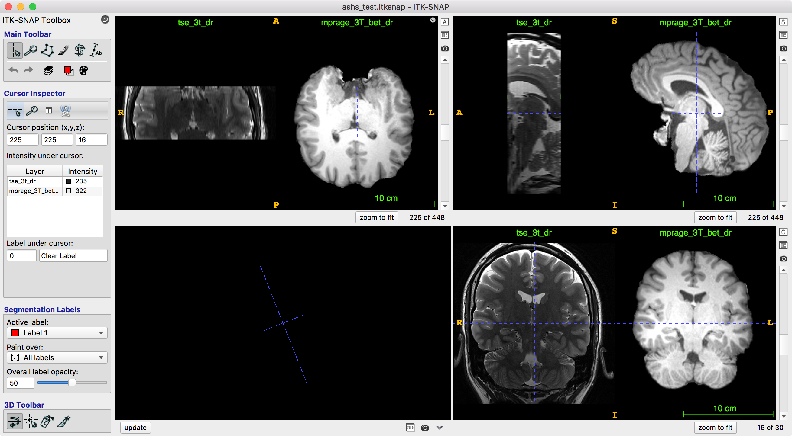
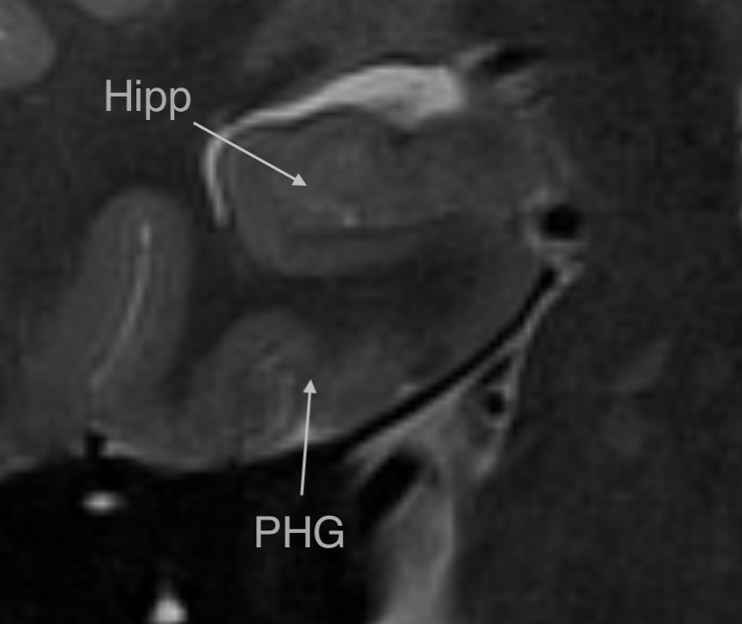
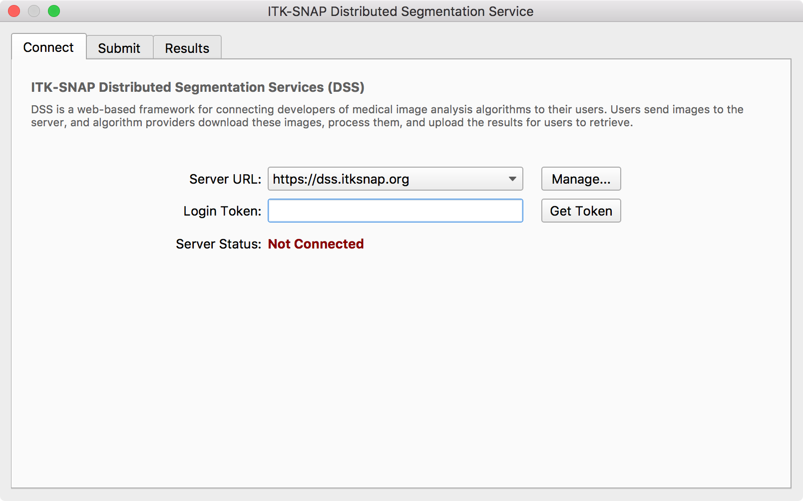
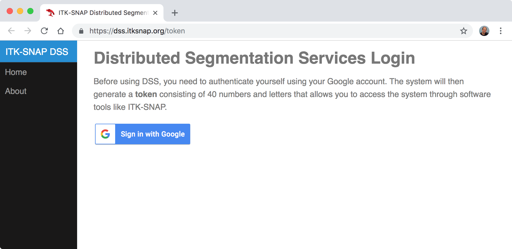
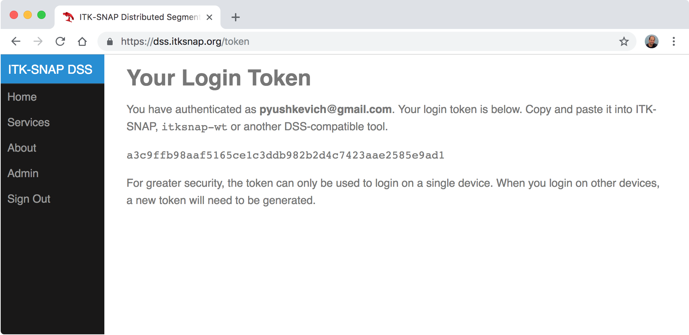
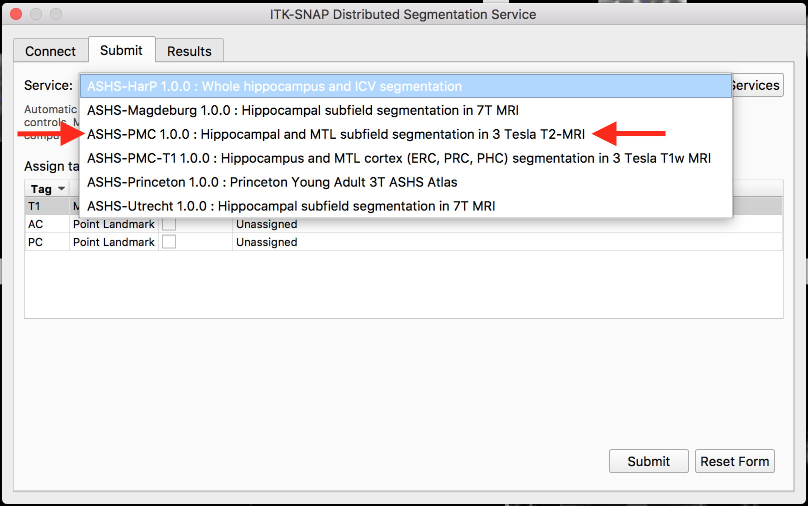
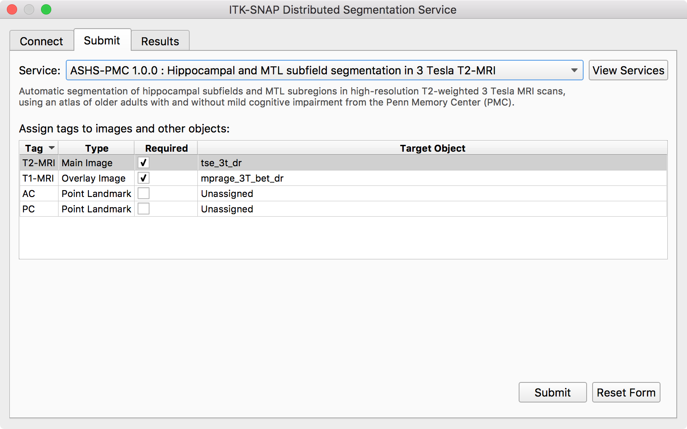
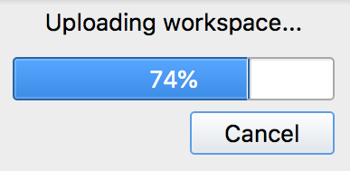
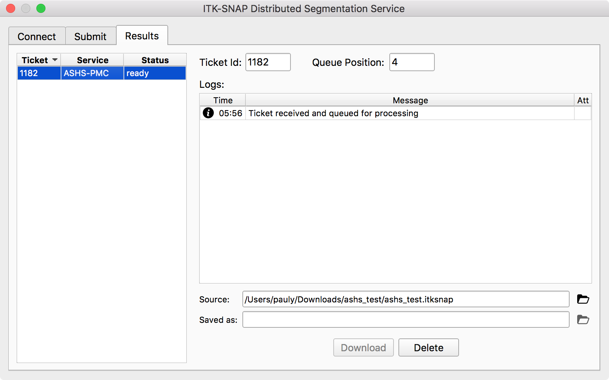
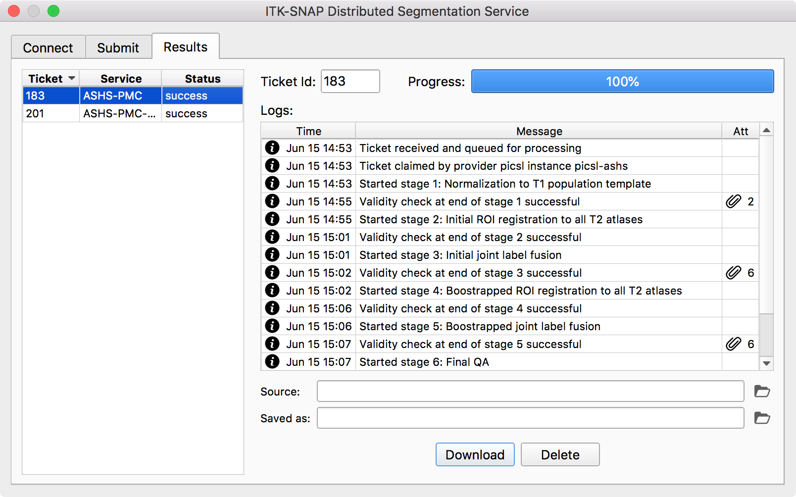

****************************
DSS User's Quick Start Guide
****************************

This quick start guide describes how to use the new Distributed Segmentation Services (DSS) functionality in ITK-SNAP 3.8 or later.

Prerequisites
=============
* `ITK-SNAP <itksnap.org>`_ 3.8 or later
* A `Google <google.com>`_ account (for authentication)
* Familiarity with the command line (for the second part of tutorial)

DSS Overview
============
DSS allows you to send image datasets directly from ITK-SNAP to external "service providers", who apply advanced image processing algorithms to your data. For example, some segmentation algorithms require a Linux cluster or a high-end graphics card (GPU). With DSS, you can use these algorithms simply by making a few mouse clicks in ITK-SNAP.

When you use DSS, you communicate with a web-based application called the "middleware server". The main middleware server for ITK-SNAP is https://dss.itksnap.org (you can visit this link and see the status of available services). Other local servers may also be set up in the future by various organizations. The DSS middleware server distributes your image datasets to service providers, who use their advanced computer hardware to perform processing on your data.

.. image:: images/dss_arch.png
    :width: 60%
    :align: center

.. warning:: At the present, DSS is intended for processing of small batches of datasets. None of the providers have the capacity to process hundreds or thousands of datasets for individual users. In the future, we envision extending this system to use cloud-based computing resources with the ability to pass the computational costs to end-users.

Running DSS from ITK-SNAP
=========================
In this tutorial, we will segment hippocampal subfields in a multi-modality MRI dataset of the human brain. Segmentation will be perfomed using the `ASHS algorithm <https://sites.google.com/view/ashs-dox/home>`_. 

Download and Open Sample Workspace
----------------------------------
A zip file containing an ITK-SNAP workspace with a high-resolution T2-weighted MRI scan of the hippocampal region and a whole-brain T1-weighted MRI scan can be obtained from the `ITK-SNAP download page <http://www.itksnap.org/pmwiki/pmwiki.php?n=Downloads.Data>`_. Or simply use the direct link below to download:

* `<https://www.nitrc.org/frs/download.php/10983/ashs_test.zip>`_.

Decomress the file ``ashs_test.zip`` and double-click the workspace file ``ashs_test.itksnap``. This should launch ITK-SNAP and load a pair of MRI scans, as shown below:

In this workspace, a high-resolution T2-weighted is loaded as the "main image" and a whole-brain T1-weighted MRI as an additional, secondary image. The ASHS algorithm will segment the subfields of the hippocampus and parahippocampal gyrus using a multi-atlas algorithm, as described in `(Yushkevich et al., 2015) <https://onlinelibrary.wiley.com/doi/full/10.1002/hbm.22627>`_. These structures play important roles in creation of memories and are affected early in Alzheimer's disease.

    A close-up view of the hippocampus and parahippocampal gyrus from the sample dataset

Connect to DSS and Register
---------------------------

From the main ITK-SNAP menu, select *Tools->Distributed Segmentation Service*. This opens the "DSS dialog", which we will use throughout this tutorial. The dialog has three tabs: "Connect", "Submit" and "Results".

To connect to the DSS system, press the **Get Token** button. This will launch a web browser that will take you to the page below. 

Press the **Sign in with Google** button and follow the prompts. You will be asked to accept the terms of use, after which you will get to a page shown below. This page contains a single-use login credential called a "token".

Copy and paste the 40-character token into the "Login Token:" field in ITK-SNAP. The server status should change to "Connected" momentarily.

Submit a Ticket to the DSS
--------------------------

The DSS uses the concept of **tickets** to track image processing tasks. When you send a dataset to DSS, a new ticket is created and assigned a unique number. As the dataset is being processed, you can track the status of your ticket, or you can request the processing to be cancelled. Tickets are autonomous, and you can close ITK-SNAP and open it later (even on another computer) to access the results for your ticket. You can submit another ticket without waiting for your first ticket to finish processing.

Go to the submit page in the DSS dialog. The drop-down box called "Services" contains a list of all services currently available on the DSS system. 

For this tutorial, select the service **ASHS-PMC 1.0.0**. The submit dialog will look like this:

The main part of the dialog consists of a table of **tags**. Tags are labels assigned to different images in the workspace that help the service provider identify which image is which (e.g., which is the T2-weighted MRI and which is the T1-weighted MRI). For this tutorial dataset, the tags should already correctly match to the images, as shown above, so you do not need to do any tag assignment. 

.. note:: In the future, we will extend the tag system to allow landmarks and manual segmentations to be tagged, so that you can provide additional input and hints to algorithms that need them. For now, only images can be tagged.

Simply press the **Submit** button. The ticket will begin to upload.

Tracking your Ticket
--------------------

Once your ticket is uploaded, the DSS dialog will switch to the "Results" page and your newly created ticket will be selected. At first, your ticket will show up in "ready" state, which means it is sitting in a queue waiting to be picked up by a service provider. Your ticket's position in the queue is shown.

Eventually, your ticket's status will change to "claimed", which means that a service provider has picked up your ticket and began processing it. You will receive regular status updates, including log messages and attachments (indicated by paper clips).

.. note:: Attachments are images or text files that are sent by the provider to illustrate the progress of the algorithm. They can be helpful for detecting problems during processing and can give you a preview of your final result. When you click an attachment in ITK-SNAP, a browser window will open showing you the attachment.

When the ticket finishes processing, it should be marked "success". You will now be able to download the ticket. You will be asked where to save the workspace containing the ticket results. This workspace will automatically open in ITK-SNAP. 

.. note:: ITK-SNAP 3.8 supports multiple segmentation layers. Algorithms like ASHS may return multiple segmentation layers (corresponding to different parameters or options in the algorithm). You can switch between the different segmentation layers using the keys ``{`` and ``}`` or by selecting *Tools->Layer Inspector*.

Using DSS from the Command Line
===============================

Please follow `the tutorial in ASHS documentation <https://sites.google.com/view/ashs-dox/cloud-ashs/cloud-ashs-command-line>`_.

